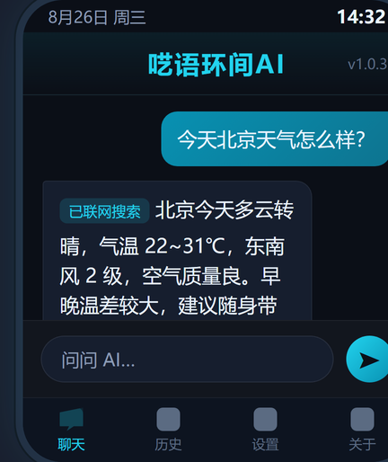

# 呓语环间AI (AIWatch)

> 运行在小米 Vela 手表上的 AI 聊天助手 —— 联网搜索、历史记录、多屏自适应

基于 **Xiaomi Vela 快应用** 技术栈开发的智能手表 AI 助手，接入 DeepSeek **Responses API**（强制联网搜索），支持语音输入外的全键盘打字交互，专为 **Redmi Watch 5** 等小屏设备设计。

## 预览



## 功能特性

- 🤖 **AI 对话**：DeepSeek V4 系列模型（`deepseek-v4-flash` / `deepseek-v4-pro`）
- 🌐 **强制联网搜索**：Responses API `web_search` 工具，日期/热点/价格类问题实时搜索，`tool_choice` 强制先搜
- 🧠 **思考过程展示**：查看 AI 的 reasoning 思维链
- 💾 **历史记录**：会话自动保存（精简入库防 storage 超限，自动淘汰最旧会话）
- ⌨️ **自绘键盘**：中文拼音 + 日语假名（罗马字输入）+ 数字/符号，三套布局
- 📱 **多屏适配**：圆屏安全区（S3/S4/S5）、240dp 大圆屏键盘缩放、px 等比自适应
- 🔌 **远程配置**：内置 `setConfig` 互联协议，可通过手机 App / AstroBox 插件同步 API 配置
- ⚡ **轻量**：单包 < 500KB，离线可用（仅对话时联网）

## 技术栈

| 项目 | 说明 |
|---|---|
| 运行平台 | Xiaomi Vela OS（快应用）|
| 语言 | JavaScript（ES5，Vela 引擎）|
| 打包 | aiot-toolkit 2.0.5（官方打包器 + RSA 签名）|
| AI 接口 | DeepSeek Responses API（含 web_search 工具）|
| 目标设备 | Redmi Watch 5（432×514）/ 圆屏手表 / 矩形手环 |

## 目录结构

```
├── dist/                  # 应用源码（可直接编辑）
│   ├── app.js             # 入口：AI 请求、历史保存、互联监听
│   ├── manifest.json      # 应用配置（包名/版本/权限）
│   ├── pages/             # 页面
│   │   ├── Home/          # 聊天主界面
│   │   ├── Settings/      # 设置（API/模型/密钥）
│   │   ├── History/       # 历史记录
│   │   ├── About/         # 关于
│   │   ├── Think/         # 思考过程
│   │   └── Input/         # 自绘键盘 + 输入法（拼音/日语）
│   └── common/            # 图片资源
├── pack.js                # 一键打包脚本
├── docs/screenshot.png    # 预览截图
└── README.md
```

## 更新日志

### v1.0.37（无密钥分发版）

- 🔓 **无内置密钥**：适合分发给他人，API Key 请在手表「设置」页自行填写
- 💾 **历史保存双保险**：store 模块 + 页面直写 storage 双通道保存，单通道失效时另一通道兜底
- 🔁 **保存失败自动重试**：写入失败 2 秒后自动重试一次
- 🐛 **修复**：诊断代码错误引用模块（`$app_require$1` 只能在模块作用域使用，页面方法内不可用）
- 📌 **storage 服务异常**：见下方「注意事项 5」——重启手表即可恢复

### v1.0.36

- 移除全部诊断代码（不再弹出测试 toast）
- 历史保存双保险 + 失败自动重试

### v1.0.35 / v1.0.34

- 诊断版：定位到 **storage 系统服务偶发异常** 是历史丢失根因（重启恢复）

### v1.0.28 ~ v1.0.33

- 时间注入：每次对话自动附带手表当前时间，AI 回答日期/实时类问题更准确
- 历史保存链路排查与修复

### v1.0.3 及更早

- 全新 UI（呓语环间AI 品牌）、联网搜索、自绘键盘、多屏适配、思考过程展示

## 构建

### 环境要求

- Node.js ≥ 16
- aiot-toolkit（`@aiot-toolkit/aiotpack`，已配置在 `E:/Hermes/vela-quote/node_modules`，可按需修改 `pack.js` 中的路径）

### 打包

```bash
node pack.js
```

产物输出到 `rpks/com.yiyun.aiwatch.debug.<版本>.rpk`。

> ⚠️ 每次修改后记得在 `manifest.json` / `manifest-watch.json` 中递增 `versionCode`（建议 +1）。

## 安装

1. 下载 [AstroBox](https://abox.run)（手机/电脑均可）
2. 蓝牙连接手表 → 导入 `dist` 打包出的 `.rpk` 安装
3. 首次使用在手表「设置」页填写 API 地址 / 模型 / API Key

> 已知问题：部分情况下安装进度条卡在最后一步（设备端偶发），**手表重启后重试**即可；或换电脑版 AstroBox。

## 配置

| 配置项 | 默认值 | 说明 |
|---|---|---|
| API 地址 | `https://api.deepseek.com` | 兼容 OpenAI 格式地址 |
| 模型 | `deepseek-v4-flash` | 需支持联网搜索的模型 |
| API Key | 无（需自行填写）| 本仓库**不内置任何密钥** |

配置同步方式：
- 手表「设置」页手动填写
- 手机端配置同步器（与手表互联，需同签名）

## 多屏适配

- **px 等比缩放**：`designWidth=432`，任意屏幕自动适配
- **圆屏安全区**：`@media (shape: circle)` 条件样式，S1 Pro/S3/S4/S5 四角不裁切
- **大圆屏键盘**：240dp 机型键盘自动缩放 0.96

## 注意事项

1. **密钥安全**：仓库不包含任何 API 密钥，请自行配置并妥善保管
2. **安装间歇故障**：设备端安装器偶发崩溃（`install result message missing`），重启手表重试
3. **互联授权**：与手机 App 的互联授权需要「包名 + 签名」与安卓端一致，且需通过官方渠道（小米运动健康）安装才能记录签名指纹
4. **Vela 引擎限制**：代码必须 ES5（无箭头函数/Promise/setInterval），CSS 受限（无 `flex:1` 简写、无后代选择器）
5. **storage 服务异常**：手表长时间运行后 storage 系统服务偶发异常，表现为**历史记录消失、新对话不保存**（写入失败但存储空间充足）。**解决办法：长按侧键重启手表**，服务恢复后已保存的历史记录会重新出现（这是手表系统问题，非应用 bug，无需重装）

## 免责声明

本项目仅供学习交流。API 密钥、网络流量等费用由使用者自行承担。
